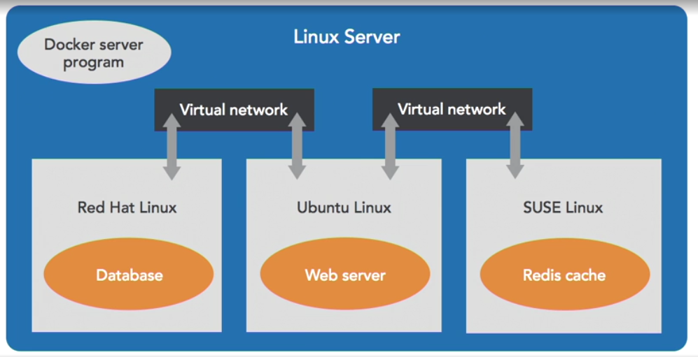
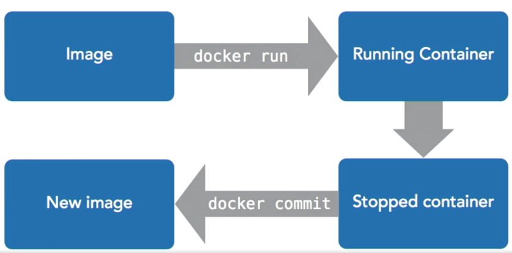
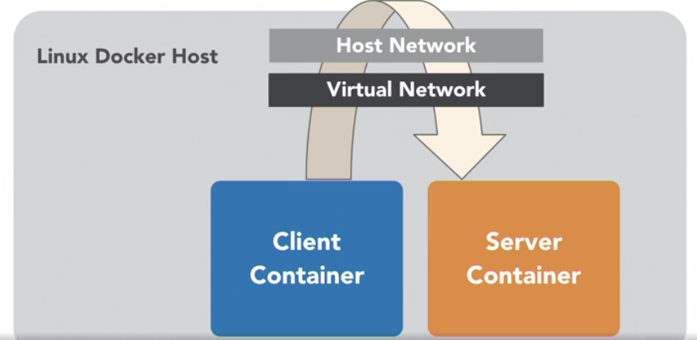

# Learning docker course notes

## Terms

- Docker is NOT a VM
- self contained, sealed unit of software
- contains everything required to run the code including the OS

Container:

- includes code, configs, processes, networking and dependencies, OS

Docker is 
- a client program named docker that is used on the command line
- a server program that manages a linux system

## Using docker

### The docker flow

Image -> `docker run` -> running container -> stopped container

- `docker images` shows images on the system
- `docker run -ti ubuntu:latest` downloads (if necessary) and runs an ubuntu image from dockerhub with with an **i**nteractive **t**erminal
- `docker -ps` shows running containers; the **image and containers IDs are unrelated**

An image is *fixed* and *doesn't change* when doing stuff inside the container. When a container is stopped however, it (and the files created in it) still exist.

- `docker ps -a` shows all containers including stopped ones (Status=exited).
- `docker ps -l` shows the last stopped container.

A container is stopped when the process running inside it is stopped, e.g. when running `docker run -ti ubuntu:latest bash` (bash is the program we want to run in it, though we don't really need `bash` here as it's the default shell and we already indicated we want an interactive terminal), and we exit the bash shell using `exit`, the container is stopped but still exists.

We can restart a stopped container using `docker 

After doing changes in a container (installing software etc), we can use the container to create a new image from it including our changes using `docker commit`.

How to create a new image from a modified container step by step:

    pk@pk-lightshow:~$ docker run -ti ubuntu
    root@58b52b38371f:/# touch importantfile.txt
    root@58b52b38371f:/# exit
    exit
    pk@pk-lightshow:~$ docker ps -l
    CONTAINER ID   IMAGE     COMMAND   CREATED          STATUS                     PORTS     NAMES
    58b52b38371f   ubuntu    "bash"    25 seconds ago   Exited (0) 9 seconds ago             charming_taussig
    pk@pk-lightshow:~$ docker commit 58b5
    sha256:b2f950146ac5905748cc37496fc0ddc5c4d7732c1cf9495baa596300ba63d5db
    pk@pk-lightshow:~$ docker tag b2f950146a my-image
    pk@pk-lightshow:~$ docker run -ti my-image
    root@53dcc08d80b6:/# ls -l imp*
    -rw-r--r-- 1 root root 0 Aug 22 09:04 importantfile.txt

`docker commit` can also take the container name instead of the ID, like in most docker commands, and the image can be assigned directly instead of using `docker tag`:

`docker commit happy_poitras my-images-2`

### Run processes in containers

 `docker run`

- containers have a main process
- the container stops when that process stops
- containerse can have names
- give the container a name with --name option for easier access later

Containers can be deleted automatically when the main process exits / the container stops using the `--rm` option:

Example: start a container that just sleeps for 5 seconds (`-ti` just so we can see it) and then stops and is deleted:

`docker run --rm ubuntu sleep 5`

Running multiple consecuitive commands:

`docker run -ti ubuntu bash -c "sleep 3;  echo all done"`

Detach a container and leave it running in the background using `-d`; use `bash -c "command -options ..."` instead of just `command -options ...`, otherwise it will not go immediately back to the hosts command line (why?).

`docker run -d -ti ubuntu bash`

This will display the container ID which can be used to "log in" to the container again (the containers name can also be used):

`docker attach [id or name]`

    pk@pk-lightshow:~/projects/lynda/learning_docker$ docker run -d -ti ubuntu bash
    941477002f218e22001a4a67622b6742bad56ae15b829a76ddb25b0de6ce8808
    pk@pk-lightshow:~/projects/lynda/learning_docker$ docker ps
    CONTAINER ID   IMAGE     COMMAND   CREATED         STATUS         PORTS     NAMES
    941477002f21   ubuntu    "bash"    6 seconds ago   Up 6 seconds             lucid_hermann
    pk@pk-lightshow:~/projects/lynda/learning_docker$ docker attach lucid_hermann 
    root@941477002f21:/# exit

When inside a running container, the key sequence `strg-p, strg-q` will exit the container but keep it running in the background.

`docker exec`

- starts another process in an existing container
- great for debugging and DB administration
- can't add ports, volumes etc

E.g. create a shell in a running container with id 424f*:

`docker exec -ti 424f bash`

When the original process is exited / dies, the attached process is exited as well.

### Manage containers

#### Looking at container output

`docker logs` can be used to output the stdout of an exited container:

    pk@pk-lightshow:~$ docker run --name example -d ubuntu bash -c "lose /etc/password"
    4b8deb5317f901fa53d844d96f404a5ecd5872d7b5e482c08c08dacac3600190
    pk@pk-lightshow:~$ docker logs example 
    bash: lose: command not found

#### Stopping and removing containers

Killing a running container puts it into stop state.

`docker kill [container name]`

Remove the container:

`docker rm [container name]`

#### Resource constraints

`docker run --memory [maximum-allowed-memory]`
`docker run --cpu-shares [relative to other containers in %]`
`docker run --cpu-quota [hard limit in %]`

Ressouce constraints are generally required by container orchestration solutions.

#### Lessons from the field:

- don't let containers fetch dependencies when they start (e.g. node fetching its dependencies). Risk (besides longer start up time): dependencies might be removed from the repo later. Include all dependencies inside
- don't leave important things in unnamed stopped containers

### Exposing ports

- programs in containers are isolated from the internet by default (e.g., a simple container started with `docker run -ti ubuntu` can't `apt-get install` anything by default)
- containers can be grouped into "private" networks
- you explicitely choose who can connect to whom
- expose ports to let connections in
- private networks to connect between containers

#### Exposing a specific port

- use `-p hostport:containerport` (for **p**ublish) to expose port(s)
- multiple `-p` options can be used:

Example:

Start a server that uses nc (**n**et**c**at) to listen to connection on one port and outputting it to another (ubuntu14.04 includes `nc`, the latest one doesn't):

    pk@pk-lightshow:~$ docker run --rm -ti -p 45678:45678 -p 45679:45679 --name echo-server ubuntu:14.04 bash
    root@37d5d1da6892:/# nc -lp 45678 | nc -lp 456789

Docker can expose ports dynamically; if only one port is specified, e.g. `-p 3000`, the *HOST* machines port is chose automatically from the unused ports. This allows many containers running programs with fixed ports. This is often used with a service discovery program, e.g. in kubernetes.

These can be found using `docker port [container name or id]` or `docker ps`

    pk@pk-lightshow:~$ docker run --rm -d -p 45678 -p45679 --name echo-server ubuntu:14.04 bash -c "nc -lp 45678 | nc -lp 45679"6029d9730acf038587332ae520477d0e4da155a4a2d99a1675f9088ec7ec4515
    pk@pk-lightshow:~$ docker ps
    CONTAINER ID   IMAGE          COMMAND                  CREATED         STATUS         PORTS                                                                                          NAMES
    6029d9730acf   ubuntu:14.04   "bash -c 'nc -lp 456…"   8 seconds ago   Up 7 seconds   0.0.0.0:49162->45678/tcp, :::49162->45678/tcp, 0.0.0.0:49161->45679/tcp, :::49161->45679/tcp   echo-server
    pk@pk-lightshow:~$ docker port echo-server 
    45678/tcp -> 0.0.0.0:49162
    45678/tcp -> :::49162
    45679/tcp -> 0.0.0.0:49161
    45679/tcp -> :::49161

#### Exposing UDP ports

`docker run -p outside-port:inside-port/protocol (tcp/udp)`, e.g. `docker run -p 1234:1234/udp`

### Container networking

By exposing ports, containers can connect to each other *over the host network*:

More efficient would be if the containers connected directly over the virtual network:

Docker networks can be shown using `docker network ls`:

    pk@pk-lightshow:~$ docker network ls
    NETWORK ID     NAME                     DRIVER    SCOPE
    bd13faa49809   bridge                   bridge    local
    36c3f2e24bbd   fullstack_default        bridge    local
    bfa7753b3fe7   host                     host      local
    e188b3fe8f7d   none                     null      local
    b111637ac485   phpdocker_test_default   bridge    local
    64abf14af77a   phpworkshop_default      bridge    local
