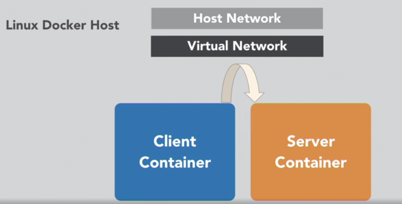
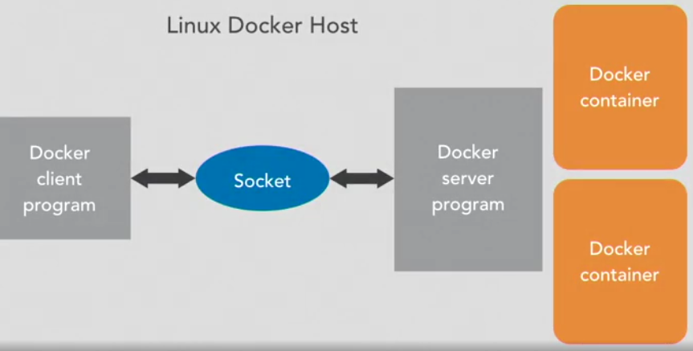
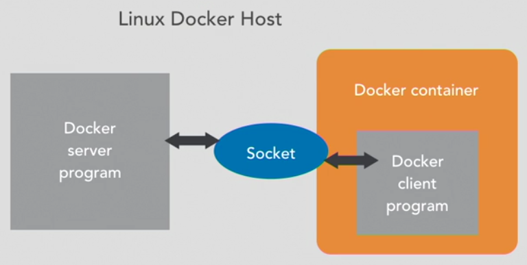
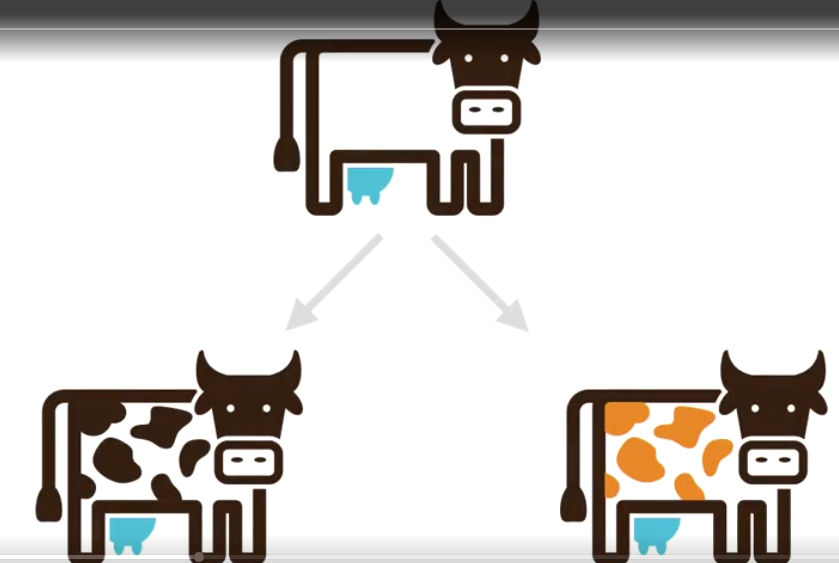

# Learning docker course notes

## Terms

- Docker is NOT a VM
- self contained, sealed unit of software
- contains everything required to run the code including the OS

Container:

- includes code, configs, processes, networking and dependencies, OS

Docker is 
- a client program named docker that is used on the command line
- a server program that manages a linux system

## Using docker

### The docker flow

Image -> `docker run` -> running container -> stopped container

- `docker images` shows images on the system
- `docker run -ti ubuntu:latest` downloads (if necessary) and runs an ubuntu image from dockerhub with with an **i**nteractive **t**erminal
- `docker -ps` shows running containers; the **image and containers IDs are unrelated**

An image is *fixed* and *doesn't change* when doing stuff inside the container. When a container is stopped however, it (and the files created in it) still exist.

- `docker ps -a` shows all containers including stopped ones (Status=exited).
- `docker ps -l` shows the last stopped container.

A container is stopped when the process running inside it is stopped, e.g. when running `docker run -ti ubuntu:latest bash` (bash is the program we want to run in it, though we don't really need `bash` here as it's the default shell and we already indicated we want an interactive terminal), and we exit the bash shell using `exit`, the container is stopped but still exists.

We can restart a stopped container using `docker 

After doing changes in a container (installing software etc), we can use the container to create a new image from it including our changes using `docker commit`.

How to create a new image from a modified container step by step:

    pk@pk-lightshow:~$ docker run -ti ubuntu
    root@58b52b38371f:/# touch importantfile.txt
    root@58b52b38371f:/# exit
    exit
    pk@pk-lightshow:~$ docker ps -l
    CONTAINER ID   IMAGE     COMMAND   CREATED          STATUS                     PORTS     NAMES
    58b52b38371f   ubuntu    "bash"    25 seconds ago   Exited (0) 9 seconds ago             charming_taussig
    pk@pk-lightshow:~$ docker commit 58b5
    sha256:b2f950146ac5905748cc37496fc0ddc5c4d7732c1cf9495baa596300ba63d5db
    pk@pk-lightshow:~$ docker tag b2f950146a my-image
    pk@pk-lightshow:~$ docker run -ti my-image
    root@53dcc08d80b6:/# ls -l imp*
    -rw-r--r-- 1 root root 0 Aug 22 09:04 importantfile.txt

`docker commit` can also take the container name instead of the ID, like in most docker commands, and the image can be assigned directly instead of using `docker tag`:

`docker commit happy_poitras my-images-2`

### Run processes in containers

 `docker run`

- containers have a main process
- the container stops when that process stops
- containerse can have names
- give the container a name with --name option for easier access later

Containers can be deleted automatically when the main process exits / the container stops using the `--rm` option:

Example: start a container that just sleeps for 5 seconds (`-ti` just so we can see it) and then stops and is deleted:

`docker run --rm ubuntu sleep 5`

Running multiple consecuitive commands:

`docker run -ti ubuntu bash -c "sleep 3;  echo all done"`

Detach a container and leave it running in the background using `-d`; use `bash -c "command -options ..."` instead of just `command -options ...`, otherwise it will not go immediately back to the hosts command line (why?).

`docker run -d -ti ubuntu bash`

This will display the container ID which can be used to "log in" to the container again (the containers name can also be used):

`docker attach [id or name]`

    pk@pk-lightshow:~/projects/lynda/learning_docker$ docker run -d -ti ubuntu bash
    941477002f218e22001a4a67622b6742bad56ae15b829a76ddb25b0de6ce8808
    pk@pk-lightshow:~/projects/lynda/learning_docker$ docker ps
    CONTAINER ID   IMAGE     COMMAND   CREATED         STATUS         PORTS     NAMES
    941477002f21   ubuntu    "bash"    6 seconds ago   Up 6 seconds             lucid_hermann
    pk@pk-lightshow:~/projects/lynda/learning_docker$ docker attach lucid_hermann 
    root@941477002f21:/# exit

When inside a running container, the key sequence `strg-p, strg-q` will exit the container but keep it running in the background.

`docker exec`

- starts another process in an existing container
- great for debugging and DB administration
- can't add ports, volumes etc

E.g. create a shell in a running container with id 424f*:

`docker exec -ti 424f bash`

When the original process is exited / dies, the attached process is exited as well.

### Manage containers

#### Looking at container output

`docker logs` can be used to output the stdout of an exited container:

    pk@pk-lightshow:~$ docker run --name example -d ubuntu bash -c "lose /etc/password"
    4b8deb5317f901fa53d844d96f404a5ecd5872d7b5e482c08c08dacac3600190
    pk@pk-lightshow:~$ docker logs example 
    bash: lose: command not found

#### Stopping and removing containers

Killing a running container puts it into stop state.

`docker kill [container name]`

Remove the container:

`docker rm [container name]`

#### Resource constraints

`docker run --memory [maximum-allowed-memory]`
`docker run --cpu-shares [relative to other containers in %]`
`docker run --cpu-quota [hard limit in %]`

Ressouce constraints are generally required by container orchestration solutions.

#### Lessons from the field:

- don't let containers fetch dependencies when they start (e.g. node fetching its dependencies). Risk (besides longer start up time): dependencies might be removed from the repo later. Include all dependencies inside
- don't leave important things in unnamed stopped containers

### Exposing ports

- programs in containers are isolated from the internet by default (e.g., a simple container started with `docker run -ti ubuntu` can't `apt-get install` anything by default)
- containers can be grouped into "private" networks
- you explicitly choose who can connect to whom
- expose ports to let connections in
- private networks to connect between containers

#### Exposing a specific port

- use `-p hostport:containerport` (for **p**ublish) to expose port(s)
- multiple `-p` options can be used:

Example:

Start a server that uses nc (**n**et**c**at) to listen to connection on one port and outputting it to another (ubuntu14.04 includes `nc`, the latest one doesn't):

    pk@pk-lightshow:~$ docker run --rm -ti -p 45678:45678 -p 45679:45679 --name echo-server ubuntu:14.04 bash
    root@37d5d1da6892:/# nc -lp 45678 | nc -lp 456789

Docker can expose ports dynamically; if only one port is specified, e.g. `-p 3000`, the *HOST* machines port is chose automatically from the unused ports. This allows many containers running programs with fixed ports. This is often used with a service discovery program, e.g. in kubernetes.

**THE QUIZ SAYS ASSIGNING ONLY ONE PORT ASSIGNS IT TO THE SAME PORT ON THE HOST, BUT RANDOM IS TRUE**

These can be found using `docker port [container name or id]` or `docker ps`

    pk@pk-lightshow:~$ docker run --rm -d -p 45678 -p45679 --name echo-server ubuntu:14.04 bash -c "nc -lp 45678 | nc -lp 45679"6029d9730acf038587332ae520477d0e4da155a4a2d99a1675f9088ec7ec4515
    pk@pk-lightshow:~$ docker ps
    CONTAINER ID   IMAGE          COMMAND                  CREATED         STATUS         PORTS                                                                                          NAMES
    6029d9730acf   ubuntu:14.04   "bash -c 'nc -lp 456…"   8 seconds ago   Up 7 seconds   0.0.0.0:49162->45678/tcp, :::49162->45678/tcp, 0.0.0.0:49161->45679/tcp, :::49161->45679/tcp   echo-server
    pk@pk-lightshow:~$ docker port echo-server 
    45678/tcp -> 0.0.0.0:49162
    45678/tcp -> :::49162
    45679/tcp -> 0.0.0.0:49161
    45679/tcp -> :::49161

#### Exposing UDP ports

`docker run -p outside-port:inside-port/protocol (tcp/udp)`, e.g. `docker run -p 1234:1234/udp`

### Container networking

By exposing ports, containers can connect to each other *over the host network*:

More efficient would be if the containers connected directly over the virtual network:

Docker networks can be shown using `docker network ls`:

    pk@pk-lightshow:~$ docker network ls
    NETWORK ID     NAME                     DRIVER    SCOPE
    bd13faa49809   bridge                   bridge    local
    36c3f2e24bbd   fullstack_default        bridge    local
    bfa7753b3fe7   host                     host      local
    e188b3fe8f7d   none                     null      local
    b111637ac485   phpdocker_test_default   bridge    local
    64abf14af77a   phpworkshop_default      bridge    local

- bridge: default for containers that don't specify any other network
- host: container doesn't have any network isolation at all
- none: no networking

A network can be created using 

`docker network create [network name]`

Containers can be attached to those networks using `--net`:

`docker run --rm -ti --net learning --name catserver ubuntu:14.04 bash`

It is especially important / useful to give the container a name as the containers can refer to each other using those names.

Containers can be on **multiple networks**

For the examples below, we first create a network with the name "learning":

    docker network create [network name]

Terminal 1 (pinging itself just to check):

    docker run --rm -ti --net learning --name catserver ubuntu:14.04 bash
    root@9e07fce74450:/# ping catserver
    PING catserver (172.21.0.2) 56(84) bytes of data.
    64 bytes from 9e07fce74450 (172.21.0.2): icmp_seq=1 ttl=64 time=0.039 ms

Terminal 2 (pinging catserver from dogserver):

    pk@pk-lightshow:~$ docker run --rm -ti --net learning --name dogserver ubuntu:14.04 bash
    root@20d2d264045c:/# ping catserver
    PING catserver (172.21.0.2) 56(84) bytes of data.
    64 bytes from catserver.learning (172.21.0.2): icmp_seq=1 ttl=64 time=0.106 ms

Create another network only for cats and put catserver on it (on a host terminal):

    pk@pk-lightshow:~$ docker network create catsonly
    09a32d8f6227d9cc5e5795de693405b306c8d96ff5777daaabcec9da7b16d449
    pk@pk-lightshow:~$ docker network connect catsonly catserver

Terminal 3 (adding another cat to catserver):

    pk@pk-lightshow:~$ docker run --rm -ti --net catsonly --name bobcatserver ubuntu:14.04 bash
    root@017a1a934b71:/# ping catserver
    PING catserver (172.22.0.2) 56(84) bytes of data.
    64 bytes from catserver.catsonly (172.22.0.2): icmp_seq=1 ttl=64 time=0.169 ms
    ...
    root@017a1a934b71:/# ping dogserver
    ping: unknown host dogserver
    root@017a1a934b71:/# 

Here, catserver and dogserver can still connect to each other, catserver can connect to bobcatserver but dogserver can't connect to bobcatserver.

### Legacy linking (avoid)

- Links all ports, but only one way
- environment variables are shared (but only one way)
- depends on startup order
- restarts only sometimes break the links
- usage: `docker run --link catserver [...]`

Sidenote: environment variables can be passed to containers using the `-e` option, e.g.

`docker run -e SECRET=verysecretthing [...]`

### Images

`docker images` lists existing images. Images with the same ID share just one image (under different names), so they don't take up as much space as it looks.

#### Tagging images

- tagging gives images names
- `docker commit [containerid] [desired name]:[tag (optional, default: "latest")]` tags images for you.

Example of name structure (leave out unneeded parts):

`registry.example.com:port/organization/image-name:version-tag`

`Organization/image-name` is often enough.

#### Getting images

`docker pull [image]` pulls an image; it's run automatically by `docker run`. Might be useful for offline work.

#### Cleaning up

- delete a single image: `docker rmi [image-name:tag or image-id]` 
- delete all images, containers, volumes and networks that are dangling / not associated with a container: `docker system prune` 
- also remove any stopped containers: `docker system prune -a` 
- Remove all exited containers: `docker rm $(docker ps -a -f status=exited -q)`
- Remove all images:`docker rmi $(docker images -a -q)`

### Volumes

#### Sharing data between host and container

- virtual "discs" to store and share data, or rather a shared folder that is mapped between the container and the host.
- two main varieties:
  - persistent
  - ephemeral (only exist as long as they're used by a container)
- not part of images

The shared folder can be indicated by using `-v` with `docker run`. Note that the **abosulute path of the folder is necessary**, so `-v ./example_share` or `-v example_share` will not work.

It is, like with ports, followed by `:` and the desired path on the host system.

    docker run -ti -v /home/pk/projects/lynda/learning_docker/example_share:/shared-folder ubuntu bash

This works also with a single file instead of a folder. In this case, the file must exist before the container is started or it will be assumed to be a directory.

#### Sharing data between containers

- `volumes-from`
- only exist as long as they are being used
- can be shared between containers

These are created by using just the path of the folder in the container:

    docker run --rm -ti -v /shared-data --name vol1 ubuntu bash

The folder can then be shared with other containers using `--volumes-from`:

    docker run --rm -ti --volumes-from vol1 ubuntu bash

The shared-data folder will now be accessible in the newly created container. This can be done will multiple containers and daisy chained (a third container can "inherit" from the second container using `--volumes-from` and doesn't have to reference the "original" one).

### Docker registries

Docker images are retrieved from registries. Registries manage and distribute images. You can your own registry as well.

#### Finding images

- `docker search [keyword]`
- [hub.docker.com](http://hub.docker.com) with more information on how to use the container
- images under http://hub.docker.com/_/[...] are official / generally safe containers 

#### Creating / uploading images

- Login using the command line using `docker login`
- tag the image using `docker tag imagename:[version] [login name]/[new image name]:[version]`
- push it to the registry using `docker push [login name]/[new image name]:[version]`

**these images are public and can be used by anyone**

Tips:

- clean up images regularly
- push containers you really need in case they get deleted by the party providing them
- be aware of who created the containers

## Building docker images

### What are docker files?

Dockerfile is used to describe how to build a docker image instead of using command line parameters.

Command:

`docker build -t [name of result] -f [dockerfile location] [context directory or URL]`

where name and dockerfile location are optional. 

The entire context is sent to the docker daemon, so use an empty directory and keep the dockerfile there.

To build the dockerfile in the current directory, the minimal command is

`docker build .`

When done, the image will be available in the local docker registry.

Each image takes the image from the previous line and makes another image; the previous image is unchanged; it does not modify the state from the previous line.
You don't want large files to span lines or the image will be huge.

>The Docker daemon runs the instructions in the Dockerfile one-by-one, committing the result of each instruction to a new image if necessary, before finally outputting the ID of your new image. The Docker daemon will automatically clean up the context you sent.
>Note that each instruction is run independently, and causes a new image to be created - so RUN cd /tmp will not have any effect on the next instructions.
> [Official dockerfile documentation](https://docs.docker.com/engine/reference/builder/)

>Only the instructions RUN, COPY, ADD create layers. Other instructions create temporary intermediate images, and do not increase the size of the build.
>[from docker best practices](https://docs.docker.com/develop/develop-images/dockerfile_best-practices/)

The steps / images in the dockerfile are cached, so parts that change the most should be put at the end of the dockerfile.

Processes started on one line will *not be running* on the next line, so more than one operations that should operate on the same container must be on the same line.

Environment variables set with `ENV`*do* persist on the next line.

### Build basic docker files

The Dockerfiles name must be `Dockerfile`.

The most basic Dockerfile:

    # Specify what image to start from. busybox is supertiny with a shell
    FROM busybox
    # In that container, echo something
    RUN echo "building simple docker image"
    # set command to run when the image is started
    # there can be only one CMD in a dockerfile;
    # if there are multiple, only the last one will take effect
    CMD echo "Hello container"

Output:

    pk@pk-lightshow:~/projects/lynda/learning_docker/building_dockerfiles$ docker build .
    Sending build context to Docker daemon  2.048kB
    Step 1/3 : FROM busybox
    latest: Pulling from library/busybox
    8ec32b265e94: Pull complete
    Digest: sha256:b37dd066f59a4961024cf4bed74cae5e68ac26b48807292bd12198afa3ecb778
    Status: Downloaded newer image for busybox:latest
    ---> 42b97d3c2ae9
    Step 2/3 : RUN echo "building simple docker image"
    ---> Running in 15c74c9803b8
    building simple docker image
    Removing intermediate container 15c74c9803b8
    ---> c063a20563cd
    Step 3/3 : CMD echo "Hello container"
    ---> Running in 0d3fa0b790a4
    Removing intermediate container 0d3fa0b790a4
    ---> 0ce0a604924c
    Successfully built 0ce0a604924c
    pk@pk-lightshow:~/projects/lynda/learning_docker/building_dockerfiles$
    pk@pk-lightshow:~/projects/lynda/learning_docker/building_dockerfiles$ docker run --rm 0ce0a
    Hello container

### Installing programs

Self explanatory

    FROM debian:sid
    RUN apt-get -y update
    RUN apt-get -y install nano
    # when run, opens a notes file (command and parameters, "exec form")
    CMD ["nano" "/tmp/notes"]

After running `docker build -t pkro/nanoer .`, running `docker run --rm -ti pkro/nanoer` will run the container and start nano.

When exiting nano, the container is stopped as with the "exec form", the nano editor is the main task of the container, not the shell (which isn't started at all).

### Adding files

Note: we are starting from the container we created in the previous step. As only the last CMD is executed, we don't have to worry about the CMD in it.

    # start with previously created container
    # or we could put the creation steps (minus CMD) here to start from scratch
    FROM pkro/nanoer
    # copy notes.txt in the current (context) directory into container
    ADD notes.txt /notes.txt
    CMD ["/bin/nano", "/notes.txt"]

### Dockerfile syntax

#### FROM

- indicates which image to start from (and download if necessary)
- must be the first command in dockerfile
- multiple are possible (see [multi-project dockerfiles section](#multi-project-docker-files) )

#### MAINTAINER

Defines the author of the dockerfile, `MAINTAINER Firstname Lastname <email@example.com>`

#### RUN

Runs the command line, waits for it to finish, and saves the result, e.g. `RUN unzip install.zip /opt/install`

#### ADD

- Adds local files `ADD run.sh /run.sh`
- Adds (uncompresses) the *contents* of archives `ADD project.tar.gz /install/`
- Works with URLs `ADD https://project.example.com/download/example.rpm /project/`

#### ENV

- sets environment variables that will still be available in the resulting image (during build and final). `ENV DB_PORT=5432`

#### ENTRYPOINT
- `ENTRYPOINT` specifies the start of the command to run, so everything added at the end of `docker run` is appended to it

If your container acts like a command-line program, use ENTRYPOINT

#### CMD

- `CMD` specifies the whole command to run; it gets replaced when the container is run with it's own command, e.g. "bash" at the end.
  - if ENTRYPOINT exists, content of CMD will be added as if added at the end of `docker run`

Note that CMD and ENTRYPOINT has three forms:

    # exec form (preferred); doesn't start any shell
    CMD ["executable", "param1", "param2"]
    # params are parameters for the executable defined
    # in ENTRYPOINT
    CMD ["param1", "param2"]
    # Shell form (only this one does shell processing so ENV vars can be used)
    # will execute /bin/sh -c
    CMD executable param1 param2

If unsure, use CMD

#### EXPOSE

Maps a port into the container, e.g. `EXPOSE 8080:8080`

#### VOLUME

Defines shared or ephemeral volumes;

- Shared: `VOLUME ["/host/path/", "/container/path"]`
- Ephemeral (can still be shared with other containers): `VOLUME ["/shared-data"]`
- Avoid defining shared folders in dockerfiles because then it will only work on the specific computer

#### WORKDIR

>Sets the working directory (in the container) for any RUN, CMD, ENTRYPOINT, COPY and ADD instructions that follow it in the Dockerfile
> [workdir reference on docker.com](https://docs.docker.com/engine/reference/builder/#workdir)

This will also be the working dir in the finished image.

#### USER

Sets the user the container will run as (**important for shared folders**)

    # using username
    USER arthur
    # using user ID
    USER 1000

[Article on common pitfalls when sharing web folders with php/docker](https://jtreminio.com/blog/running-docker-containers-as-current-host-user/#ok-so-what-actually-works)

### Multi-project Docker files

We might want to have a complete and large dockerfile and a small production dockerfile. If we use 2 separate files, these might get out of sync at some point.

[Dockerfile best practices](https://docs.docker.com/develop/develop-images/dockerfile_best-practices/)

    FROM ubuntu:16.04 as builder
    RUN apt-get update
    RUN apt-get -y install curl
    # write google character count in google-size file
    RUN curl https://google.com | wc -c > google-size
    ENTRYPOINT echo google is this big; cat google-size

Build / run:

    docker build -t pkro/googlesize .
    docker run --rm pkro/googlesize

This produces a large image (~180mb).

Dockerfile:

    FROM ubuntu:16.04 as builder
    RUN apt-get update
    RUN apt-get -y install curl
    # write google character count in google-size file
    RUN curl https://google.com | wc -c > google-size
    
    FROM alpine
    COPY --from=builder /google-size /google-size
    ENTRYPOINT echo google is this big; cat google-size

Build / run:

    docker build -t pkro/googlesize2 .
    docker run --rm pkro/googlesize2

This produces a much smaller image (< 6mb). But this just copies the already created textfile in a smaller alpine linux, so it's a bad example as it doesn't really do a character count.

### Avoid golden images

= an image that replaces a canonical build with a locally-modified version.

- include installer of the software that gets installed in your project as it may not be available in the future
- have a canonical build system that builds everything from scratch / from a standard base image
- tag builds with the git hash of the code that built it. Don't overwrite images that were used before.
- Use small base images such as Alpine 
- build images that oyu share publicly from dockerfiles, always
- don't ever leave passwords in layers. Delete them in the same step

## Under the hood

### What kernels do

The kernel runs directly on the hardware.

Responsibilities:

- Respond to messages from the hardware
- starts and schedules programs
- controls and organizes storage
- pass messages between programs
- allocates ressources, memory, CPU, network

### Docker

- program written in Go
- manages kernel features
  - Uses "cgroups" to contain processes; this keeps containers interfering which each other
  - uses "namespaces" to contain networks / split networking stack
  - uses "copy-on-write" file systems to build images
- Used for years before docker, but made easy and popular by docker
- Docker is 2 programs: a client and a server.
- The server receives commands over a socket (network or unix-style "file" socket when on the same computer). The socket is located in `/var/run/docker.sock`. Writing into this file in the proper formate causes the docker server to do stuff.
- the client can even run inside docker itself

Running docker locally:

Running the client inside a container:

We share the socket file between host and container so they can communicate and start docker.

    # on host
    docker run -ti --rm -v /var/run/docker.sock:/var/run/docker.sock docker sh
    # in the container we just started:
    docker run -ti --rm ubuntu bash

This is NOT a docker server inside a docker server, it's a client inside a docker container controlling the hosts docker server via the docker.sock.

### Networking and namespaces

#### Network in brief

- Ethernet: moves "frames" of data on a wire (or Wi-Fi)
- IP layer: moves packets on a local network
- Routing: forwards packets between networks
- Ports: address particular programs / services on a computer

#### Bridging

- Docker uses bridges to create virtual networks in your computer
- these are software switches
- they control the ethernet layer

      # reminder: --net=host gives full access to the hosts networking stack
      docker run --rm -ti --net=host ubuntu:16.04 bash
      # inside the container
      root@pk-lightshow:/# apt-get update && apt-get install bridge-utils
      root@pk-lightshow:/# brctl show
      bridge name     bridge id               STP enabled     interfaces
      docker0         8000.0242614a79bc       no 
      
      # on host, new terminal
      # docker network create my-new-network

      # in container it shows the new network now:
      root@pk-lightshow:/# brctl show
      bridge name     bridge id               STP enabled     interfaces
      br-968b669c1e47         8000.0242eff1b79d       no              
      docker0         8000.0242614a79bc       no  

#### Routing

- Creates linux built in "firewall" (iptables) rules to move packets between networks
- = NAT (Network address translation); changes source / destination address on the way out / in

Exposing ports in docker is just port forwarding at the networking layer.

Proof:
    
    # terminal 1:
    docker run -ti --rm -p 8080:8080 ubuntu bash

    # terminal 2
    # --privileged=true gives the container full control over the system
    # that is hosting it
    docker run -ti --rm --net=host --privileged=true ubuntu bash
    apt-get install iptables
    iptables -n -L -t nat | grep 8080
    MASQUERADE  tcp  --  172.17.0.2           172.17.0.2           tcp dpt:8080
    DNAT       tcp  --  0.0.0.0/0            0.0.0.0/0            tcp dpt:8080 to:172.17.0.2:8080

#### Namespaces

Keep containers and host system safe from each other.

- allow processes to be attached to private network segments
- these private networks are bridged into a shared network with the resot of the containers
- containers have virtual network "cards"
- containers get their own copy of the networking stack

### Processes and cgroups

#### Primer on Linux processes

- processes come from other processes - parent-child relationship
- when a child process exits, it returns an exit code to its parent
- process zero is special; called *init*, the process that starts the rest

In Docker the container starts with an init process and vanishes when that process exits.

`docker inspect` can be used to extract any information you need from a container, here we use it to check what's the init process.

    # Terminal 1:
    docker run -ti --rm --name hello ubuntu bash

    # Terminal 2:
    # .State.Pid = process id of the process
    docker inspect --format '{{.State.Pid}}' hello
    # the main process ID
    13364
    # start another container with even higher privileges (--pid=host)
    docker run -ti --rm --privileged=true --pid=host ubuntu bash
    kill 13364

    # Container in Terminal 1 is killed automatically (exit is not entered at the
    # shell but the output of the container as it exits)
    root@6c737bf5828f:/# exit
    pk@pk-lightshow:~$

#### Ressource limiting

- scheduling CPU time
- memory allocation limits
- inherited limitations and quotas
- can't escape limits by starting more processes (?)

### Storage

#### Unix storage in brief

- lowest layer: actual storage devices
- next layer: logical storage devices
- next layer: filesystems
- FUSE filesystems and network filesystems

#### The secret of docker: COWs - Copy On Write

Docker images are read only!

Instead of writing information directly to an image, it is written on a layer that is put over that image and give 
that to the container. So the container sees the image with the new information, but the image without the added 
information still exists and can be used by another container to put its own layer on.

#### Moving cows
- The contents of layers are moved between containers in gzip files.
- Containers are independent of the storage engine
- any container can be loaded almost anywhere
- it is possible to run out of layers in some storage engines (doesn't come up often)

#### Volumes and Bind Mounting

- The linux VFS (Virtual file system)
- mounting devices on the vfs
- mounting directories on the vfs

Bind mounting in action:

    pk@pk-lightshow:~$ docker run -ti --rm --privileged=true ubuntu bash
    root@a28d4a816aaf:/# mkdir example
    root@a28d4a816aaf:/# cd example/
    root@a28d4a816aaf:/example# mkdir work
    root@a28d4a816aaf:/example# cd work
    root@a28d4a816aaf:/example/work# touch a b c d e f
    root@a28d4a816aaf:/example/work# ls
    a  b  c  d  e  f
    root@a28d4a816aaf:/example/work# cd ..
    root@a28d4a816aaf:/example# mkdir other-work
    root@a28d4a816aaf:/example# cd other-work/
    root@a28d4a816aaf:/example/other-work# touch other-a other-b other-c other-d
    root@a28d4a816aaf:/example/other-work# ls
    other-a  other-b  other-c  other-d
    root@a28d4a816aaf:/example/other-work# cd ..
    root@a28d4a816aaf:/example# ls -R
    .:
    other-work  work
    
    ./other-work:
    other-a  other-b  other-c  other-d
    
    ./work:
    a  b  c  d  e  f
    root@a28d4a816aaf:/example# mount -o bind other-work work
    root@a28d4a816aaf:/example# ls -R
    .:
    other-work  work
    
    ./other-work:
    other-a  other-b  other-c  other-d
    
    ./work:
    other-a  other-b  other-c  other-d
    root@a28d4a816aaf:/example# umount work
    root@a28d4a816aaf:/example# ls -R
    .:
    other-work  work
    
    ./other-work:
    other-a  other-b  other-c  other-d
    
    ./work:
    a  b  c  d  e  f
    root@a28d4a816aaf:/example# 

Gist is that a b c d e f weren't gone but the content of other-work was layered on top of it by using bind.

- So it's important getting the mount order correct using the -v or volumes directives
- Mounting volumes always mounts the host's filesystem over the guest! Never the other way around.

## Orchestration - building systems with docker

### Registries in detail

#### What is a docker registry?

- Program
- stores layers and images
- listens on port 5000 (default)
- maintains an index and searches tags
- authorizes and authenticates connections

#### Popular docker registries

- The official python docker registry
- nexus

#### Running the docker registry in docker

Running a local registry in docker:

    docker run -d -p 5000:5000 --restart=always --name registry registry:2
    # tag and assign a registry
    docker tag ubuntu:16.04 localhost:5000/mycompany/my-ubuntu:99
    # push image locally so we don't depend on the repo
    docker push localhost:5000/mycompany/my-ubuntu:99

[Setting up a registry @ docker.com](https://docs.docker.com/registry/)

[registry deployment & security @ docker.com](https://docs.docker.com/registry/deploying/)

Storage:

- local storage
- docker trusted registry
- amazon elastic container registry
- google cloud container registry
- azure container registry

#### Saving and loading containers without a registry

Docker images can be simply saved locally without a registry as well using `docker save` and `docker load`:

    # o for output
    docker save -o my-images.tar.gz debian:sid busybox ubuntu:16.04
    # delete local images we just saved (for testing)
    docker rmi debian:sid busybox ubuntu:16.04
    # reload them from the archive
    docker load -i my-images.tar.gz
    
This is also useful for migrating between storage types.

### Intro to orchestration

There are many orchestration systems for docker. They are used to

- start containers (and restart them on failure)
- service discovery - allow them to find each other
- ressource allocation - match containers to computers (that have the needed ressources)

#### Docker compose

Docker compose is an orchestration system for single machine coordination and is designed for testing and development.

It brings up all your containers, volumes, networks etc. with one command: `docker-compose up`

#### Kubernetes

Kubernetes terminology and functionality:

- *Containers* run programs
- *Pods* group containers together on the same system
- *Services* make pods available to others
- *Labels* are used for very advanced service discovery

Advantages:

- The `kubectl` command makes scripting large operations possible.
- Kubernetes has very flexible overlay networking
- runs equally well on local hardware or a cloud provider

#### EC2 container service (ECS)

- *Task definitions* define a set of containers that always run together (a little like pods)
- *Tasks* actually make a container run right now
- *Services*

Advantages:

- connects load balancers to services
- can create own host instances in AWS
- make your instances start the agent and join the cluster
- pass the docker control socket into the agent
- provides docker repos
- containers (tasks) can be part of CloudFormation stacks which makes deployment along with other resources very easy.

[get started with ecs](https://aws.amazon.com/ecs/)

*no notes on videos [Kubernetes in AWS EKS]((https://www.linkedin.
com/learning/learning-docker-2018/kubernetes-in-aws?
u=82598426) and [google kubernetes engine](https://www.linkedin.
com/learning/learning-docker-2018/kubernetes-in-aws?
u=82598426) 

## Next steps

- Learn more about docker-compose
- Make a personal development image